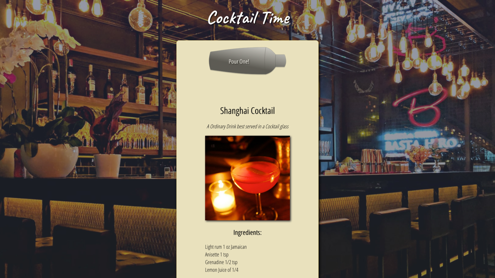

# Cocktail Time 2.0

Cocktail Time 2.0 is the second version of a random cocktail generator I made when I was first learning to code. It utilizes the same API from https://www.thecocktaildb.com/. In the first iteration, I used an ES5 AJAX request. I found the code was long and not easy to read through. In this version, I used the ES6 fetch method. It is much cleaner and faster to put together. This was also the first program I made using react.js. Have a good happy hour!

Live Site: https://cocktailtime.netlify.app/

